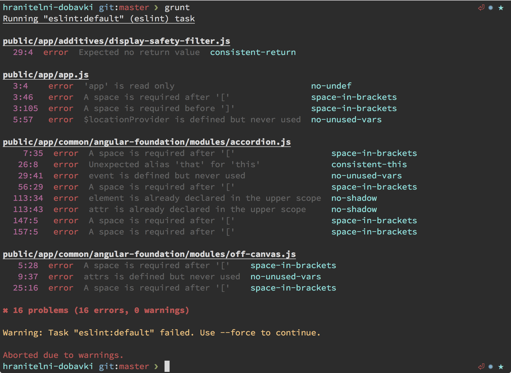

# ESLint Stylish [](https://travis-ci.org/svil4ok/eslint-stylish-config)

## Install

Install with [npm](https://npmjs.org/package/eslint-stylish-config): `npm i --save-dev eslint-stylish-config`

## Getting started

Use it with:

#### JSHint CLI

```
eslint --format node_modules/eslint-stylish-config/stylish.js file.js
```

#### [grunt-eslint](https://github.com/sindresorhus/grunt-eslint)

```js
require('load-grunt-tasks')(grunt); // npm install --save-dev load-grunt-tasks

grunt.initConfig({
  eslint: {
    options: {
      format: require('eslint-stylish-config')
    },
    target: ['file.js']
  }
});

grunt.registerTask('default', ['eslint']);
```

## Configuring colors

In this ex edition you can put an optional `.stylishcolors`-file in the root of your project to modify the output style of the reporter.

```js
{
  "path"        : "bold",
  "position"    : "magenta",
  "warning"     : "yellow",
  "error"       : "red",
  "description" : "gray",
  "rule"        : "cyan",
  "summary"     : "gray",
  "noproblem"   : "green"
}
```

You can set one of the available styling options that [chalk](https://github.com/sindresorhus/chalk) supports:

### Modifiers

- `reset`
- `bold`
- `dim`
- `italic` *(not widely supported)*
- `underline`
- `inverse`
- `hidden`
- `strikethrough` *(not widely supported)*

### Colors

- `black`
- `red`
- `green`
- `yellow`
- `blue` *(on Windows the bright version is used as normal blue is illegible)*
- `magenta`
- `cyan`
- `white`
- `gray`

### Background colors

- `bgBlack`
- `bgRed`
- `bgGreen`
- `bgYellow`
- `bgBlue`
- `bgMagenta`
- `bgCyan`
- `bgWhite`

## Example

> default reporter


> styled reporter



## License

MIT © [Svilen Popov](https://twitter.com/sgpopov)
