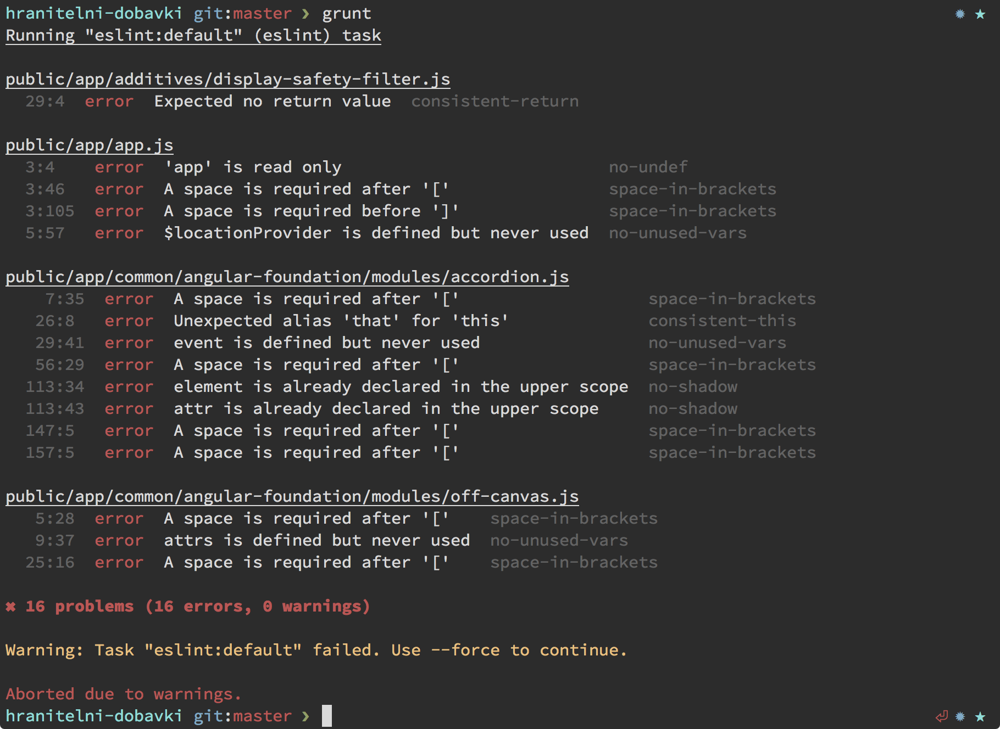

[![NPM version][npm-image]][npm-url]
[![build status][travis-image]][travis-url]

# ESLint Stylish

## Install

Install with [npm](https://npmjs.org/package/eslint-stylish-config): `npm i --save-dev eslint-stylish-config`

## Getting started

Use it with:

#### [ESLint CLI](https://github.com/eslint/eslint)

```
eslint --format node_modules/eslint-stylish-config/stylish.js file.js
```

#### [grunt-eslint](https://github.com/sindresorhus/grunt-eslint)

```js
require('load-grunt-tasks')(grunt); // npm install --save-dev load-grunt-tasks

grunt.initConfig({
  eslint: {
    options: {
      format: require('eslint-stylish-config')
    },
    target: ['file.js']
  }
});

grunt.registerTask('default', ['eslint']);
```

## Configuration

In this ex edition you can put an optional `.stylishconfig`-file in the root of your project to modify the output style of the reporter.

```js
{
  "positionFormat": "line-col-space",
  "colors": { 
    "path": "bold",
    "position": "magenta",
    "warning": "yellow",
    "error": "red",
    "description": "dim",
    "rule": "cyan",
    "summary": "gray",
    "noproblem": "green"
  }
}
```

### `positionFormat`

* **Options:** `colon`, `line-col-space`, `line-col-comma`
* **Default:** `colon`

> when `colon`


> when `line-col-space`


> when `line-col-comma`


### `colors`


For the colors you can set one of the available styling options that [chalk](https://github.com/sindresorhus/chalk) supports:

| Style             | Options                            |
|------------------ | ---------------------------------- |
| modifiers | `reset`, `bold`, `dim`, `italic` *(not widely supported)*, `underline`, `inverse`, `hidden`, `strikethrough` |
| colors | `black`, `red`, `green`, `yellow`, `blue`, `magenta`, `cyan`, `white`, `gray` |
| background colors | `bgBlack` , `bgRed`, `bgGreen`, `bgYellow`, `bgBlue`, `bgMagenta`, `bgCyan`, `bgWhite`

## Example

> default reporter



> styled reporter


## License

MIT © [Svilen Popov](https://twitter.com/sgpopov)

[npm-image]: https://img.shields.io/npm/v/eslint-stylish-config.svg?style=flat-square
[npm-url]: https://www.npmjs.com/package/eslint-stylish-config
[travis-image]: https://img.shields.io/travis/svil4ok/eslint-stylish-config/master.svg?style=flat-square
[travis-url]: https://travis-ci.org/svil4ok/eslint-stylish-config
